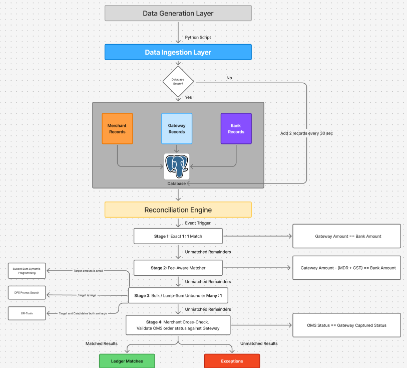

# Project Neon — Reconciliation Engine

An autonomous 3-way financial reconciliation engine that resolves discrepancies across Gateway, Bank, and Merchant ledgers in real time, powered by an AI copilot for natural language root-cause analysis.

## Prerequisites

- Python 3.11+
- Node.js 18+
- PostgreSQL 14+ (running locally or accessible remotely)
- A Groq API key (for the Q&A agent)
- An NVIDIA NIM API key (for guardrails, optional)


# Architecture Flowcahrt




---

## 1. Database Setup (do this first)

The backend will not start without a working Postgres database.

1. **Create the database:**

   ```sql
   CREATE DATABASE finance_controller;
   ```
2. **Run the schema.** From the `backend/` folder:

   ```
   psql -U postgres -d finance_controller -f schema.sql
   ```

   This creates all required tables (`gateway_records`, `bank_records`, `ledger_matches`, `exceptions`, `reconciliation_runs`, `merchant_records`, `audit_logs`) and their indexes.

   **Warning:** `schema.sql` starts with `DROP TABLE ... CASCADE`. Only run this on a fresh database — re-running it on an existing one wipes all data.
3. **Set your database connection env vars** — see `.env.example` below. Defaults assume a local Postgres on `localhost:5432` with a `postgres` user and no password; override these to match your actual setup.
4. **Seed sample data.** From `backend/`:

   ```
   python -m data.generator --period 2026-05 --baseline 300
   ```

   This generates 300 realistic gateway/bank/merchant records for the given period, including exceptions and lump-sum batch settlements. Repeat per period you want data for, or use `--seed-all` to seed several months at once.

---

## 2. Backend Setup

From `backend/`:

```
python -m venv venv
venv\Scripts\activate        # Windows
source venv/bin/activate     # macOS/Linux

pip install -r requirements.txt
```

Create a `.env` file in `backend/`:

```env
# Database
PGHOST=localhost
PGPORT=5432
PGUSER=postgres
PGPASSWORD=your_password
PGDATABASE=finance_controller

# AI / Agent
GROQ_API_KEY=your_groq_key
GROQ_MODEL=openai/gpt-oss-120b
NVIDIA_API_KEY=your_nvidia_key
JWT_SECRET="your_jwt_token"
LOGFIRE_TOKEN="pydatic_logfire_token"
```

Run the backend:

```
python app.py
```

or

```
uvicorn app:app --reload
```

The API runs at `http://localhost:8000`. Visit `http://localhost:8000/` — you should see `{"message": "Backend is running...."}`.

**Auto-insert background job:** the backend automatically trickles in new sample rows every 30 seconds for the periods listed in `scheduler.py`'s `ACTIVE_PERIODS`. This runs automatically on startup — no separate command needed. Adjust or disable this in `scheduler.py` if not needed.

---

## 3. Frontend Setup

From `frontend/`:

```
npm install
```

Create a `.env.local` file in `frontend/`:

```env
NEXT_PUBLIC_API_URL=http://localhost:8000
```

Run the frontend:

```
npm run dev
```

Visit `http://localhost:3000`.

---

## 4. First-Time Use

1. Open the dashboard — select a period from the dropdown (must match a period you seeded in step 1.4).
2. Click **Run Reconciliation** to execute the 3-way matching engine for that period.
3. Use the **Copilot** panel to ask questions like "what's the exception rate for May?" or "show me the exceptions table."

---

## Troubleshooting

- **`ModuleNotFoundError: No module named 'reconciler'`** — you're running a script from inside a subfolder (e.g. `data/`). Run it from `backend/` instead, or use `python -m data.scriptname`.
- **Backend won't connect to Postgres** — double check `.env` values match your actual Postgres user/password/port, and that the database from step 1.1 exists.
- **`relation "..." does not exist`** — the schema wasn't applied; re-run step 1.2 (on a fresh DB only).
- **Empty dashboard for a period** — that period has no seeded data; run step 1.4 for it.
